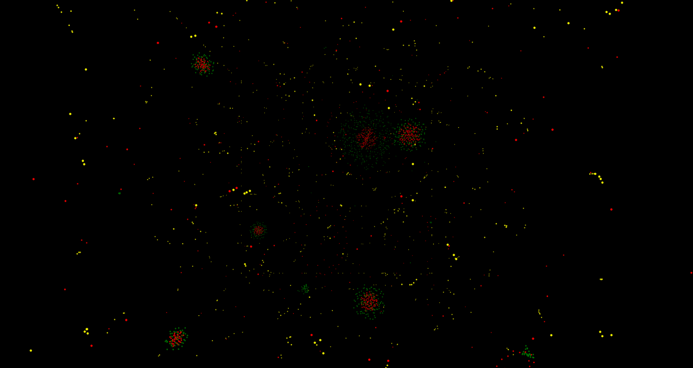
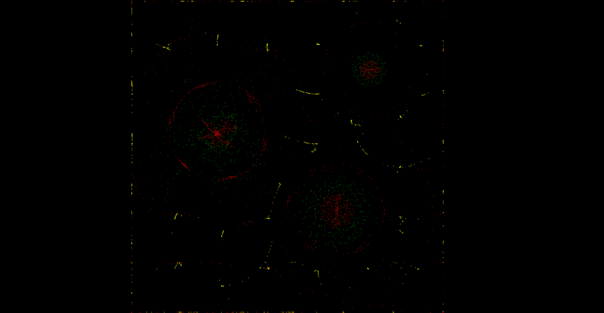

# Particles Dynamics and Simulations

Welcome to the Particle Simulations Hub! This repository contains various particle simulation projects built using Three.js, showcasing different behaviors and interactions of particles in both 2D and 3D environments.

## Projects Overview

### 1. Life Simulation 3D
- **Description**: An extension of the 2D simulation into a 3D space, allowing for more complex interactions and visualizations. This simulation adds depth and perspective, making the interactions more visually engaging.
- **Technologies**: HTML, JavaScript, Three.js
- **Features**:
  - Particles can move in three dimensions.
  - Enhanced controls for rotating, panning, and zooming.
  - Interaction forces defined for different particle types.
- **Demo**: 

### 2. Life Simulation (2D)
- **Description**: A 2D particle simulation where particles interact based on simple rules, simulating life-like behaviors. The simulation demonstrates how particles can exhibit complex behaviors through simple interactions.
- **Technologies**: HTML, JavaScript, Three.js
- **Features**:
  - Particles of different colors (yellow, red, green) interact with each other.
  - Orthographic camera for a 2D view.
  - Controls for panning and zooming.
- **Demo**: 


## Getting Started

To run any of the simulations locally, follow these steps:

1. **Clone the repository**:
   ```bash
   git clone https://github.com/Rhishavhere/part.Dynamics.git
   cd part.Dynamics
   ```

2. **Open the HTML file**:
   - Open `index.html` in your web browser to view the simulation.

## Usage

- Use the mouse to interact with the simulations:
  - **2D Simulation**: Right-click to pan, scroll to zoom.
  - **3D Simulation**: Drag to rotate, scroll to zoom, right-click drag to pan.

## Configuration

You can customize the simulations by modifying the parameters in the `script.js` files. Here are some key parameters you can adjust:

- **Particle Count**: Change the number of particles in the simulation.
- **Interaction Forces**: Modify how particles interact with each other (e.g., attraction, repulsion).
- **Color Schemes**: Customize the colors of the particles for better visual distinction.


## Acknowledgments

- Inspiration from various particle simulation projects and research.
